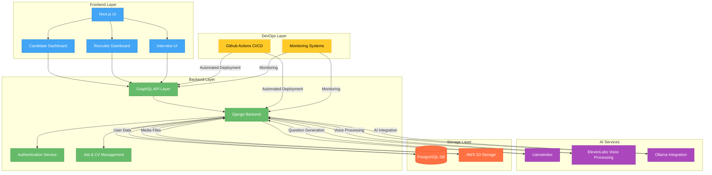
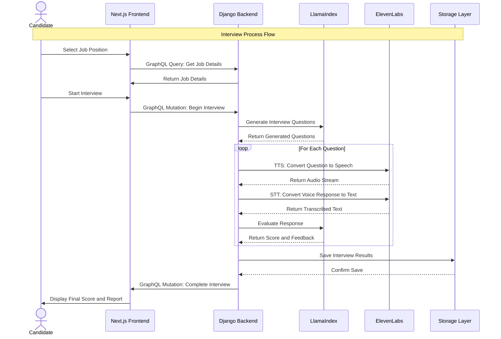
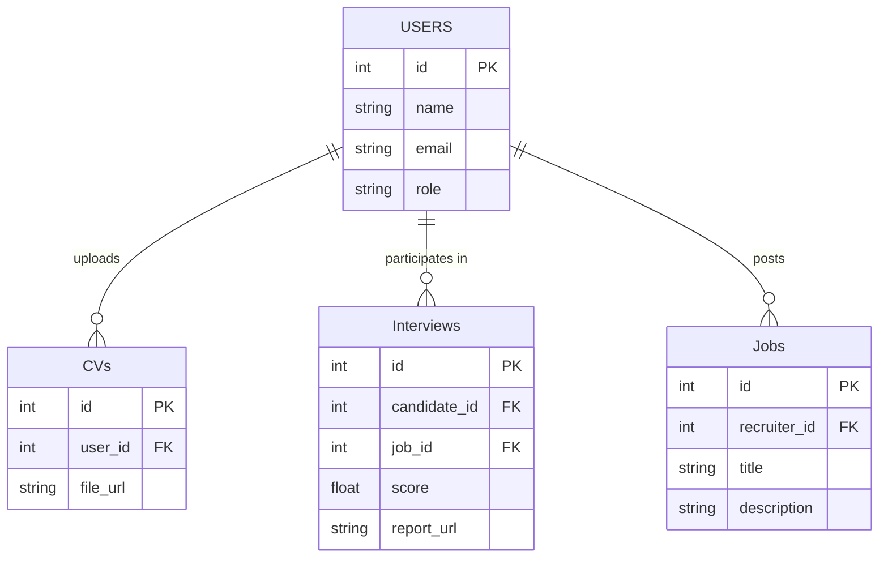
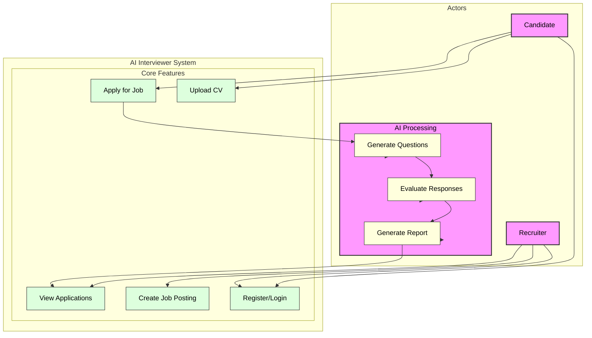
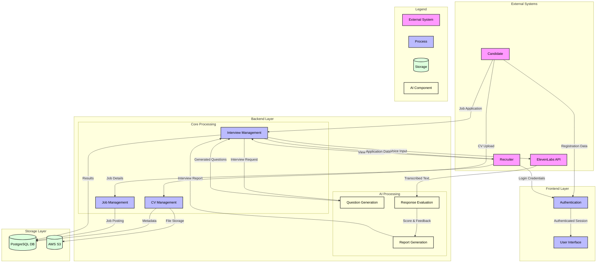

# 🎙️ AI Interviewer – Smart Hiring, Powered by AI  

AI Interviewer is an intelligent hiring assistant that conducts **AI-driven job interviews**, evaluates candidates, and provides recruiters with actionable insights.  

🚀 **Features:**  
✅ **AI-Generated Questions** – Dynamically tailored interview questions  
✅ **Voice-Based Q&A** – Real-time speech-to-text & AI evaluation  
✅ **Candidate Scoring** – Automated assessment based on responses  
✅ **CV & Job Matching** – AI-powered CV analysis for better hiring  
✅ **GraphQL API** – Flexible data retrieval for recruiters  

🔧 **Tech Stack:**  
- **Frontend:** Next.js (React)  
- **Backend:** Django (GraphQL API)  
- **AI Services:** LlamaIndex, ElevenLabs, Ollama  
- **Storage:** PostgreSQL, AWS S3  
- **CI/CD:** GitHub Actions  

📖 **Read the full documentation** ➡️ [README.md](./README.md)  

💻 **Get Started:**  
git clone https://github.com/your-username/ai-interviewer.git
cd ai-interviewer

# 🧠 AI Interviewer

AI Interviewer is an AI-powered system that conducts job interviews, evaluates candidates, and provides recruiters with insights.

## 🚀 Features  
- 🔹 AI-generated interview questions  
- 🎙️ Voice-based Q&A (Speech-to-Text & AI evaluation)  
- 📑 CV analysis and job matching  
- 📊 Candidate scoring and recruiter dashboard  

---

## 📜 System Architecture  

### 🏗️ **High-Level Architecture**

# 🧠 AI Interviewer – Interview Process Flow  

This diagram represents the **interview process flow** from the candidate selecting a job position to receiving the final evaluation and report.

# 🧠 AI Interviewer – Interview Process Flow Explanation

This section explains the **Interview Process Flow** shown in the sequence diagram. It details how the **AI Interviewer** system works from when a candidate selects a job position to receiving their final score and report.

---

## 🎬 **Step-by-Step Flow:**

### 1. **Candidate Selects Job Position**
   - The **Candidate** chooses a job position they want to apply for.
   - The request is sent to the **Frontend (Next.js)**, which handles the user interface.

### 2. **Get Job Details**
   - The **Frontend** sends a **GraphQL query** to the **Backend (Django)** to retrieve the details of the selected job (e.g., description, requirements).
   - The **Backend** returns the job details back to the **Frontend**.

### 3. **Start Interview**
   - The **Candidate** selects to start the interview, triggering a **GraphQL mutation** in the **Frontend** to begin the interview process.
   - The **Frontend** sends the request to the **Backend** to initiate the interview.

### 4. **Generate Interview Questions**
   - The **Backend** sends a request to **LlamaIndex** (AI service) to generate appropriate interview questions based on the job.
   - **LlamaIndex** returns the generated questions to the **Backend**.

### 5. **Interview Questions Loop**
   For each interview question:
   - **Text-to-Speech (TTS)**: The **Backend** sends each question to **ElevenLabs** for **TTS conversion** (i.e., converting the question into speech).
   - **Audio Stream Returned**: **ElevenLabs** returns the audio stream of the question to the **Backend**.

   - **Speech-to-Text (STT)**: The **Candidate** answers verbally. The **Backend** sends the audio response to **ElevenLabs** for **STT conversion** (i.e., converting speech to text).
   - **Transcribed Text Returned**: **ElevenLabs** returns the transcribed text of the candidate's answer to the **Backend**.

   - **Evaluate Response**: The **Backend** sends the transcribed text of the candidate’s response to **LlamaIndex** for evaluation.
   - **Feedback Returned**: **LlamaIndex** returns the evaluation score and feedback for the candidate’s response.

### 6. **Save Interview Results**
   - After all questions have been asked and evaluated, the **Backend** saves the interview results (score and feedback) into the **Storage Layer** (e.g., database).
   - The **Storage** system confirms that the results have been saved successfully.

### 7. **Complete Interview**
   - The **Backend** sends a **GraphQL mutation** to the **Frontend** to notify that the interview is complete.
   - The **Frontend** then displays the **Final Score** and **Report** to the **Candidate**.

---

## 🛠 **Key Components:**

- **Frontend (Next.js)**: The user interface where the **Candidate** interacts with the system (selecting jobs, starting the interview, viewing results).
- **Backend (Django)**: The central server that manages logic, requests, and interactions with other services like **LlamaIndex**, **ElevenLabs**, and the **Storage Layer**.
- **LlamaIndex**: The AI service generates interview questions and evaluates responses.
- **ElevenLabs**: Handles **Text-to-Speech (TTS)** and **Speech-to-Text (STT)** processing for voice-based interaction.
- **Storage Layer**: The database or storage system where interview results are saved for later retrieval and display.

---

This breakdown helps to understand the flow of operations in the **AI Interviewer** app and how the various components work together to provide a smooth interview experience.

# 📊 **Entity Relationship Diagram (ERD) Explanation**

The **Entity Relationship Diagram (ERD)** represents the relationships between the key entities in the **AI Interviewer** system. It shows how **Users**, **CVs**, **Interviews**, and **Jobs** are connected within the application.

---

## 🧑‍💼 **Entities & Relationships:**

### 1. **Users**
   - The **Users** table stores information about all the users in the system, which could be either candidates, recruiters, or interviewers.
   - **Attributes:**
     - `id` (Primary Key): A unique identifier for each user.
     - `name`: The full name of the user.
     - `email`: The user's email address.
     - `role`: The role of the user (e.g., Candidate, Recruiter).
   
   - **Relationships:**
     - **Uploads CVs**: Each **User** can upload multiple **CVs**.
     - **Participates in Interviews**: Each **User** can participate in multiple **Interviews** (as a candidate).
     - **Posts Jobs**: Each **User** (if a recruiter) can post multiple **Jobs**.

### 2. **CVs**
   - The **CVs** table stores uploaded CVs for users.
   - **Attributes:**
     - `id` (Primary Key): A unique identifier for each CV.
     - `user_id` (Foreign Key): References the user who uploaded the CV.
     - `file_url`: A URL to the uploaded CV file.

### 3. **Interviews**
   - The **Interviews** table stores the details of each interview, including the candidate's performance.
   - **Attributes:**
     - `id` (Primary Key): A unique identifier for each interview.
     - `candidate_id` (Foreign Key): References the **User** who is a candidate in the interview.
     - `job_id` (Foreign Key): References the **Job** being applied for.
     - `score`: The score given to the candidate based on their responses.
     - `report_url`: A URL to the detailed interview report.

### 4. **Jobs**
   - The **Jobs** table stores information about the job positions posted by recruiters.
   - **Attributes:**
     - `id` (Primary Key): A unique identifier for each job posting.
     - `recruiter_id` (Foreign Key): References the **User** who posted the job.
     - `title`: The job title.
     - `description`: A description of the job position.

---

## 📐 **ERD Representation:**

# 🔄 **Use Case Diagram Explanation**

This **Use Case Diagram** outlines the interactions between the actors (Candidate, Recruiter, and AI Services) and the various features within the **AI Interviewer** system. It shows the key use cases and how users (actors) interact with the system to perform different tasks during the interview process.

---

## 🧑‍💼 **Actors:**

### 1. **Candidate (C)**:
   - The **Candidate** is the user applying for jobs and participating in interviews.
   - The candidate can perform the following actions:
     - **Register/Login**: Register a new account or log into the system.
     - **Upload CV**: Upload their CV for job applications.
     - **Apply for Job**: Apply for a job posting.

### 2. **Recruiter (R)**:
   - The **Recruiter** is the user posting jobs and reviewing applications.
   - The recruiter can perform the following actions:
     - **Register/Login**: Register a new account or log into the system.
     - **Create Job Posting**: Post a new job opportunity.
     - **View Applications**: View the applications submitted by candidates for the jobs posted.

### 3. **AI Services (AI)**:
   - **AI Services** represents the backend processing and AI components in the system responsible for generating questions, evaluating answers, and generating reports during interviews.
   - The AI performs the following actions:
     - **Generate Questions**: Generate interview questions for the candidate based on the job.
     - **Evaluate Responses**: Evaluate the candidate's responses to the questions.
     - **Generate Report**: Create a final report based on the interview process.

---

## 💡 **System:**

The **AI Interviewer System** consists of several key features divided into core features and AI-driven processes:

### **Core Features:**
1. **Register/Login**: Users (candidates and recruiters) can create an account or log into the system to access their respective functionalities.
2. **Upload CV**: Candidates can upload their CV for consideration in job applications.
3. **Create Job Posting**: Recruiters can create job postings, including job details, position requirements, etc.
4. **Apply for Job**: Candidates can apply for jobs listed by recruiters.
5. **View Applications**: Recruiters can view the list of applications they have received for the job postings.

### **AI Processing:**
1. **Generate Questions**: After the candidate applies for a job and starts an interview, the AI generates questions specific to the role and the candidate's profile.
2. **Evaluate Responses**: The AI evaluates the candidate’s verbal responses to the interview questions.
3. **Generate Report**: The AI generates a final report, including a score and detailed feedback based on the candidate's performance in the interview.

---

## 📐 **Use Case Diagram Representation:**

# 🔄 **Data Flow Diagram (DFD) Explanation**

The **Data Flow Diagram (DFD)** illustrates the flow of data between various components within the **AI Interviewer System**. This includes the interaction between external systems, the frontend and backend layers, and the storage components. It provides a clear view of how data moves through the system, from user input to AI processing and storage.

---

## 🧑‍💼 **Actors:**

### 1. **Candidate (C)**
   - The **Candidate** is a user applying for jobs and participating in interviews.
   - Data flow: 
     - Registers with the system by sending **registration data** to the **Authentication** process.
     - Uploads their **CV**, which is then managed by the **CV Management** process.
     - Applies for a job, which triggers the **Interview Management** process.

### 2. **Recruiter (R)**
   - The **Recruiter** posts job opportunities and reviews job applications.
   - Data flow:
     - Logs into the system by providing **login credentials** to the **Authentication** process.
     - Provides **Job Details** to the **Job Management** process for job postings.
     - Views the **Applications** for job postings through the **Interview Management** process.

### 3. **ElevenLabs API (E)**
   - The **ElevenLabs API** is an external system used for voice processing.
   - Data flow: 
     - Takes **voice input** from the candidate during the interview and returns **transcribed text**.

---

## 🧠 **Backend Processes:**

### 1. **Frontend Layer:**
   - **User Interface (UI)**: Displays the system's interface for user interaction, such as job applications and interview details.
   - **Authentication (Auth)**: Manages user login, registration, and session management.

### 2. **Backend Layer:**

   - **Core Processing:**
     - **CV Management (CV)**: Handles the upload and storage of CVs.
     - **Job Management (Job)**: Manages job posting details and stores them in the database.
     - **Interview Management (Int)**: Handles job applications, interview scheduling, and stores interview data.

   - **AI Processing:**
     - **Question Generation (QGen)**: Generates interview questions based on the job and candidate profile.
     - **Response Evaluation (Eval)**: Evaluates the candidate's responses to interview questions.
     - **Report Generation (Rep)**: Generates a final interview report with feedback and scores.

---

## 💾 **Storage Layer:**

   - **PostgreSQL DB (DB)**: Stores user profiles, job postings, interview details, and results.
   - **AWS S3 (S3)**: Stores files such as uploaded CVs.

---

## 🔄 **Data Flows:**

1. **Candidate Registration & Login:**
   - The **Candidate** registers with the system, sending their registration data to the **Authentication** process.
   - The **Recruiter** logs in with their credentials, which are processed by the **Authentication** system to create an authenticated session.
   - The session information is passed to the **User Interface (UI)** for displaying the user’s dashboard.

2. **CV Management:**
   - The **Candidate** uploads their CV, which is processed by the **CV Management** process.
   - The **CV Management** process stores the file on **AWS S3** and the metadata in the **PostgreSQL DB**.

3. **Job Posting:**
   - The **Recruiter** provides job details, which are processed by the **Job Management** process and stored in the database for later retrieval.

4. **Job Application and Interview Process:**
   - The **Candidate** applies for a job, triggering the **Interview Management** process.
   - The **Interview Management** process sends an interview request to the **Question Generation (QGen)** process.
   - **QGen** generates interview questions and sends them back to the **Interview Management** process.
   - During the interview, the **Candidate** provides voice input, which is sent to the **ElevenLabs API** for transcription.
   - The **ElevenLabs API** returns the transcribed text to the **Response Evaluation (Eval)** process for scoring and feedback.
   - The **Response Evaluation** process sends the score and feedback to the **Report Generation (Rep)** process.
   - The **Report Generation** process creates the final interview report, which is stored in the **PostgreSQL DB** as part of the interview results.

5. **Recruiter Viewing Applications:**
   - The **Recruiter** can view applications and interview results stored in the **Interview Management** process.
   - The **Interview Management** process retrieves the **application data** and presents it to the **Recruiter**.

---

## 📐 **Data Flow Diagram Representation:**

