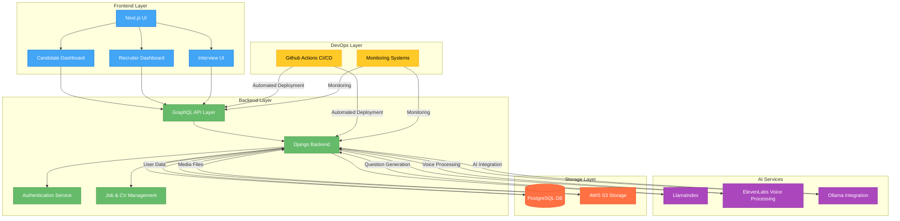
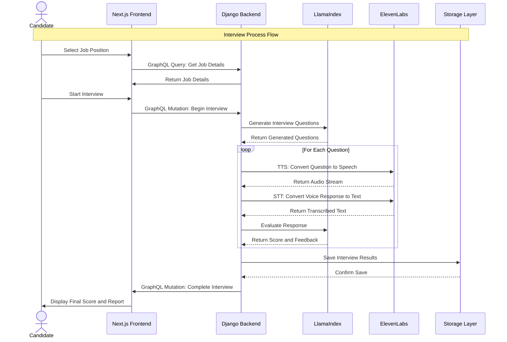

# 🎙️ AI Interviewer – Smart Hiring, Powered by AI  

AI Interviewer is an intelligent hiring assistant that conducts **AI-driven job interviews**, evaluates candidates, and provides recruiters with actionable insights.  

🚀 **Features:**  
✅ **AI-Generated Questions** – Dynamically tailored interview questions  
✅ **Voice-Based Q&A** – Real-time speech-to-text & AI evaluation  
✅ **Candidate Scoring** – Automated assessment based on responses  
✅ **CV & Job Matching** – AI-powered CV analysis for better hiring  
✅ **GraphQL API** – Flexible data retrieval for recruiters  

🔧 **Tech Stack:**  
- **Frontend:** Next.js (React)  
- **Backend:** Django (GraphQL API)  
- **AI Services:** LlamaIndex, ElevenLabs, Ollama  
- **Storage:** PostgreSQL, AWS S3  
- **CI/CD:** GitHub Actions  

📖 **Read the full documentation** ➡️ [README.md](./README.md)  

💻 **Get Started:**  
git clone https://github.com/your-username/ai-interviewer.git
cd ai-interviewer

# 🧠 AI Interviewer

AI Interviewer is an AI-powered system that conducts job interviews, evaluates candidates, and provides recruiters with insights.

## 🚀 Features  
- 🔹 AI-generated interview questions  
- 🎙️ Voice-based Q&A (Speech-to-Text & AI evaluation)  
- 📑 CV analysis and job matching  
- 📊 Candidate scoring and recruiter dashboard  

---

## 📜 System Architecture  

### 🏗️ **High-Level Architecture**

# 🧠 AI Interviewer – Interview Process Flow  

This diagram represents the **interview process flow** from the candidate selecting a job position to receiving the final evaluation and report.

