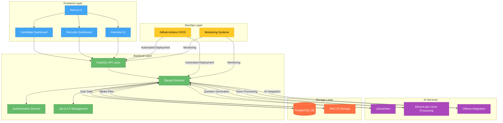
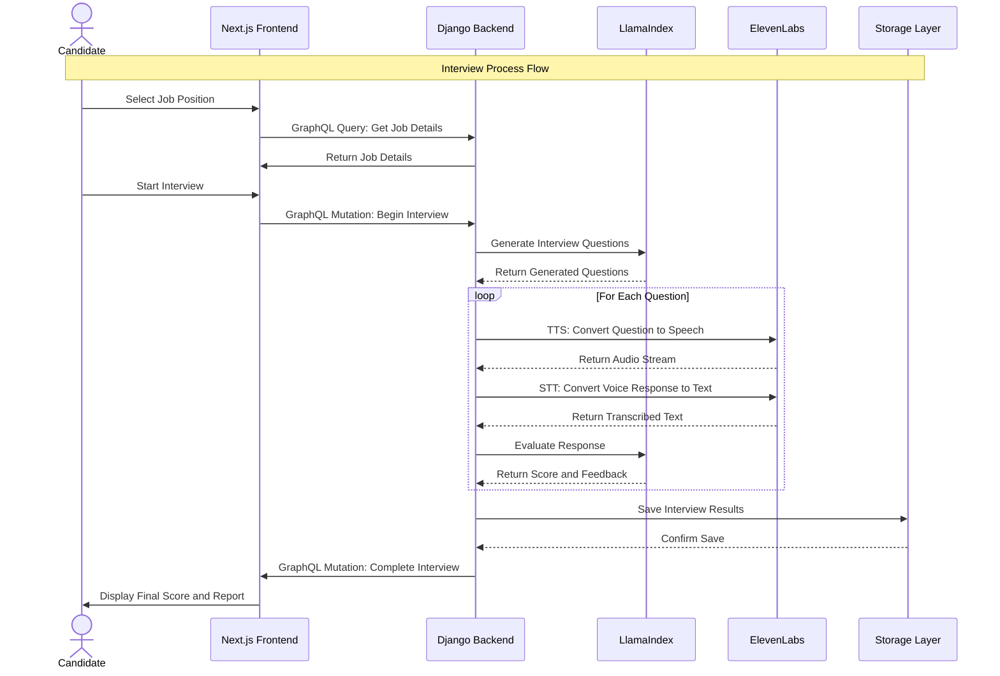

# 🎙️ AI Interviewer – Smart Hiring, Powered by AI  

AI Interviewer is an intelligent hiring assistant that conducts **AI-driven job interviews**, evaluates candidates, and provides recruiters with actionable insights.  

🚀 **Features:**  
✅ **AI-Generated Questions** – Dynamically tailored interview questions  
✅ **Voice-Based Q&A** – Real-time speech-to-text & AI evaluation  
✅ **Candidate Scoring** – Automated assessment based on responses  
✅ **CV & Job Matching** – AI-powered CV analysis for better hiring  
✅ **GraphQL API** – Flexible data retrieval for recruiters  

🔧 **Tech Stack:**  
- **Frontend:** Next.js (React)  
- **Backend:** Django (GraphQL API)  
- **AI Services:** LlamaIndex, ElevenLabs, Ollama  
- **Storage:** PostgreSQL, AWS S3  
- **CI/CD:** GitHub Actions  

📖 **Read the full documentation** ➡️ [README.md](./README.md)  

💻 **Get Started:**  
git clone https://github.com/your-username/ai-interviewer.git
cd ai-interviewer

# 🧠 AI Interviewer

AI Interviewer is an AI-powered system that conducts job interviews, evaluates candidates, and provides recruiters with insights.

## 🚀 Features  
- 🔹 AI-generated interview questions  
- 🎙️ Voice-based Q&A (Speech-to-Text & AI evaluation)  
- 📑 CV analysis and job matching  
- 📊 Candidate scoring and recruiter dashboard  

---

## 📜 System Architecture  

### 🏗️ **High-Level Architecture**

# 🧠 AI Interviewer – Interview Process Flow  

This diagram represents the **interview process flow** from the candidate selecting a job position to receiving the final evaluation and report.

# 🧠 AI Interviewer – Interview Process Flow Explanation

This section explains the **Interview Process Flow** shown in the sequence diagram. It details how the **AI Interviewer** system works from when a candidate selects a job position to receiving their final score and report.

---

## 🎬 **Step-by-Step Flow:**

### 1. **Candidate Selects Job Position**
   - The **Candidate** chooses a job position they want to apply for.
   - The request is sent to the **Frontend (Next.js)**, which handles the user interface.

### 2. **Get Job Details**
   - The **Frontend** sends a **GraphQL query** to the **Backend (Django)** to retrieve the details of the selected job (e.g., description, requirements).
   - The **Backend** returns the job details back to the **Frontend**.

### 3. **Start Interview**
   - The **Candidate** selects to start the interview, triggering a **GraphQL mutation** in the **Frontend** to begin the interview process.
   - The **Frontend** sends the request to the **Backend** to initiate the interview.

### 4. **Generate Interview Questions**
   - The **Backend** sends a request to **LlamaIndex** (AI service) to generate appropriate interview questions based on the job.
   - **LlamaIndex** returns the generated questions to the **Backend**.

### 5. **Interview Questions Loop**
   For each interview question:
   - **Text-to-Speech (TTS)**: The **Backend** sends each question to **ElevenLabs** for **TTS conversion** (i.e., converting the question into speech).
   - **Audio Stream Returned**: **ElevenLabs** returns the audio stream of the question to the **Backend**.

   - **Speech-to-Text (STT)**: The **Candidate** answers verbally. The **Backend** sends the audio response to **ElevenLabs** for **STT conversion** (i.e., converting speech to text).
   - **Transcribed Text Returned**: **ElevenLabs** returns the transcribed text of the candidate's answer to the **Backend**.

   - **Evaluate Response**: The **Backend** sends the transcribed text of the candidate’s response to **LlamaIndex** for evaluation.
   - **Feedback Returned**: **LlamaIndex** returns the evaluation score and feedback for the candidate’s response.

### 6. **Save Interview Results**
   - After all questions have been asked and evaluated, the **Backend** saves the interview results (score and feedback) into the **Storage Layer** (e.g., database).
   - The **Storage** system confirms that the results have been saved successfully.

### 7. **Complete Interview**
   - The **Backend** sends a **GraphQL mutation** to the **Frontend** to notify that the interview is complete.
   - The **Frontend** then displays the **Final Score** and **Report** to the **Candidate**.

---

## 🛠 **Key Components:**

- **Frontend (Next.js)**: The user interface where the **Candidate** interacts with the system (selecting jobs, starting the interview, viewing results).
- **Backend (Django)**: The central server that manages logic, requests, and interactions with other services like **LlamaIndex**, **ElevenLabs**, and the **Storage Layer**.
- **LlamaIndex**: The AI service generates interview questions and evaluates responses.
- **ElevenLabs**: Handles **Text-to-Speech (TTS)** and **Speech-to-Text (STT)** processing for voice-based interaction.
- **Storage Layer**: The database or storage system where interview results are saved for later retrieval and display.

---

This breakdown helps to understand the flow of operations in the **AI Interviewer** app and how the various components work together to provide a smooth interview experience.

